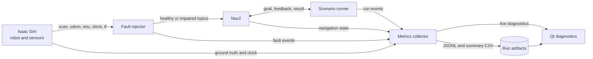

# ROS 2 Mobile Robot Profiling Lab

A simulation-first ROS 2 project that runs repeatable mobile-robot navigation tasks and provides the engineering tools needed to explain their behavior. The project combines meaningful C++ nodes, simulated sensors, controlled communication faults, automated evaluation, and a Qt diagnostic interface.

> Status: specification and architecture phase. The legacy Python pick-and-place scaffold has been removed; the Spec Kit plan now drives the incremental construction of the navigation profiling system described here.

## Project goals

- Build ROS 2 C++ nodes with explicit lifecycle, timestamp, frame, and failure behavior.
- Integrate one robot model in NVIDIA Isaac Sim with lidar, odometry, IMU, and TF data.
- Execute repeatable Nav2 goals and recover cleanly from task or process failures.
- Automate scenarios and record success rate, duration, sensor age, and selected latency metrics.
- Inject delayed and missing sensor messages under controlled, recorded conditions.
- Compare runs in a compact Qt diagnostic application.
- Publish reproducible setup instructions while documenting sources of nondeterminism.

## Architecture



All measurements use ROS time for simulation events and steady time for host-side elapsed durations. Every recorded value identifies its clock domain; values from different domains are never subtracted.

## Planned stack

| Area | Choice |
| --- | --- |
| Platform | Ubuntu 24.04, ROS 2 Jazzy |
| Simulator | NVIDIA Isaac Sim, pinned and documented after compatibility validation |
| Navigation | Nav2 |
| Robot and sensors | Differential-drive robot with lidar, odometry, IMU, TF, and simulation clock |
| Application nodes | C++20 with `rclcpp`, lifecycle nodes where restart behavior matters |
| Diagnostics | Qt 6 desktop application using ROS 2 subscriptions |
| Run artifacts | Versioned JSONL events plus CSV summaries and scenario metadata |
| Tests | `ament_cmake`, `ament_cmake_gtest`, `launch_testing`, and scenario smoke tests |

## Evaluation contract

Each run records:

- scenario ID, seed when supported, configuration hash, and software versions;
- terminal result and failure classification;
- task duration using a monotonic host clock;
- sensor message age and inter-arrival statistics;
- navigation feedback and recovery events;
- the active fault schedule and observed fault events.

Aggregate reports show trial count, success rate, duration distribution, and healthy-versus-faulted comparisons. Results are reproducible within documented tolerances, not claimed to be bit-for-bit deterministic. GPU scheduling, simulator physics, middleware discovery, executor scheduling, and host load remain possible sources of variation.

## Delivery roadmap

1. **Navigation baseline**: robot model, sensors, frame tree, Nav2, and one successful goal.
2. **Repeatable runner**: scenario schema, reset protocol, batch execution, and versioned artifacts.
3. **Failure behavior**: delayed and dropped sensor streams, timeout handling, recovery, and restart tests.
4. **Profiling UI**: live state/timing views and run-to-run comparisons in Qt.
5. **Evidence package**: automated tests, architecture notes, debugging write-up, benchmark results, and demo media.

Detailed acceptance criteria and implementation work live in [specs/001-navigation-profiling/spec.md](specs/001-navigation-profiling/spec.md), [specs/001-navigation-profiling/plan.md](specs/001-navigation-profiling/plan.md), and [specs/001-navigation-profiling/tasks.md](specs/001-navigation-profiling/tasks.md).

## Repository layout

```text
.
|-- .specify/                    # Spec Kit templates, scripts, and constitution
|-- specs/001-navigation-profiling/
|   |-- spec.md                  # User outcomes and acceptance criteria
|   |-- plan.md                  # Technical implementation plan
|   |-- research.md              # Decisions and alternatives
|   |-- data-model.md            # Scenario and run artifact model
|   |-- contracts/               # ROS and artifact contracts
|   |-- quickstart.md            # Planned validation journey
|   `-- tasks.md                 # Ordered implementation backlog
|-- docs/                        # Architecture, milestones, and debugging notes
|-- docker/                      # Reproducible development environment
|-- ros2_ws/src/                 # ROS 2 packages
`-- scripts/                     # Build, run, and validation automation
```

## Current workspace check

The workspace now contains the four planned ROS 2 package skeletons. On a
configured ROS 2 machine:

```powershell
.\scripts\run_validation.ps1
```

The command currently validates package configuration and linting. The
end-to-end simulator quickstart is intentionally tracked as planned work until
the pinned Isaac Sim and ROS 2 environment has been validated.

## Spec-driven workflow

This repository is initialized with GitHub Spec Kit. The project constitution is in [.specify/memory/constitution.md](.specify/memory/constitution.md). For future changes, evolve the specification first, then run the `speckit-plan`, `speckit-tasks`, `speckit-implement`, and `speckit-converge` skills. Keep completed feature artifacts as a living contract and reconcile them when implementation evidence changes an assumption.

## Portfolio evidence target

- Architecture and TF diagrams.
- A 60-90 second demonstration of normal and faulted runs.
- At least 20 trials per published scenario/configuration.
- Healthy-versus-faulted comparison plots or tables.
- A debugging write-up that follows one timing or frame issue from symptom to root cause.
- Honest limitations, including simulator and hardware-transfer gaps.
